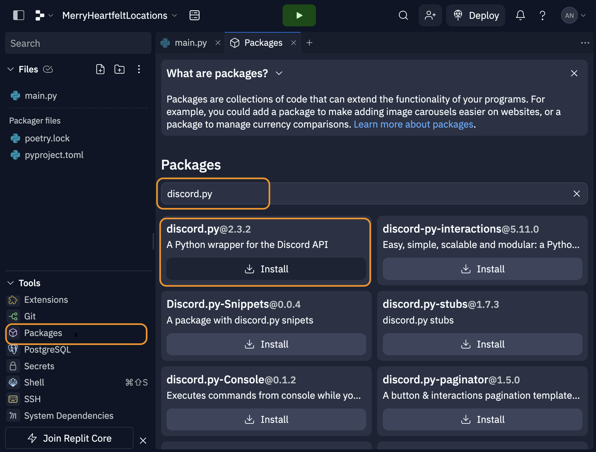

Through this walkthrough, you should have a discord bot, hosted on either your local machine, or through the online IDE Repl.it. This tutorial just builds upon a few existing online resources that you can directly reference, if you would prefer. 

- [Building a Discord bot with Python and Repl.it](https://www.codementor.io/@garethdwyer/building-a-discord-bot-with-python-and-repl-it-miblcwejz)
- [How to make a Discord Bot in Python](https://realpython.com/how-to-make-a-discord-bot-python/#interacting-with-discord-apis)

## Create app in the Discord UI

1. Sign up for a free [Discord](https://discord.com/) account
2. Go to the [Discord developer portal](https://discord.com/developers/applications) and click on the 'New Application' button. 

You will now be redirected to a page where you can configure all the options for your app, creating a bot user and more. 

1. Click on the "Bot" tab, scroll down to the 'Privileged Gateway Intents' section, and turn on the 'Message Content Intent' switch. 


Now you have to add your bot to the discord servers you want it to run in. For this project, we'll add all of our bots to the server I've created 'A Place to Talk to Bots'

1. Use the invite link to join the project server: https://discord.gg/qteg27c6vM
2. Go back to your application in the [Discord developer portal](https://discord.com/developers/applications)  
4. Navigate to the 'OAuth2 -> URL Generator' tab
5. Under 'Scopes' check the 'bot' option


1. In the Bot permissions section, check all the things that you would like to give your bot access to. Some of the permissions you would likely want to set:
	1. Read Messages/View Channels
	2. Send Messages
	3. Send Messages in Threads
	4. Read Message History
2. Copy the Generated URL at the bottom of the page and paste it into your browser.


1. You will see a page asking you which server to add this bot to. Select the 'A Place to Talk to Bots' server.
2. Click authorize
3. Once you hit accept, you should get a notification that your bot has joined the server. You can see the bot listed as a member of the server in the right panel. 

## Building Bot Behavior

In this tutorial, there are two options for running the code for your bot. You can run the code locally on your machine, or you can use an online IDE like Repl.it

Repl.it is simpler to setup and get started, and will include hosting, so you can keep your bot online all the time. However, there are storage, CPU and RAM limitations that might get in the way.

A local machine setup will be slightly more complicated if you don't have python already setup, and if you close your computer, your bot will go offline. But, you won't face as many of the resource limitations as you will with Repl.it.

I reccomend starting with Repl.it, and then moving over to a local setup if necessary in the future. 

### Setup Repl.it

1. Make an account on Repl.it
2. Click on the Create Button
3. Select 'python' under Template, give your project a name, and then click 'Create Repl'

Before we start writing code, we have to add the Discord Bot Token to our Repl.it project. This will connect our code to the Bot we created. 

4. Add the Discord Bot Token to the 'Secrets' tab of Repl.it.
	1. Go to the [Discord Developer Portal](https://discord.com/developers/applications), click on the Application you created earlier
	2. Navigate to the Bot tab, and under the 'Token' section, click on the copy button. (If the copy button doesn't appear, click on the 'Reset Token' button)
	3. In your Repl.it project, click on the 'Secrets' tool under Tools section in the sidebar. 
	4. Create a New Secret. Name the key `DISCORD_BOT_SECRET` and in the value field paste the Token that you copied from the Discord Developer Portal.


Finally, lets install the main packages that we will be using. You can use this same process to install other useful python packages in the future. 

5. Click on the packages tool under the Tools section in the sidebar
6. In the new Packages pane, search for **discord.py**, and click on the plus icon to install the library. 



### Create Hello World Bot

To actually create our Hello World bot, we'll have to write some python code into our main.py file. 

1. Let's start by importing the necessary libraries:
	- The **discord.py package** is the main way we will be working with the Discord API. ([documentation](https://discordpy.readthedocs.io/en/stable/))
	- The **os module** is a standard library (so you don't need to install it) but it isn't included by default, so you have to import it. 
```python
import discord
import os
```

2. Next let's define our bot's **"intents."** This is an object that we define to tell Discord what events our bots wants to listen to. For our bot, we want all the message_content events. 
   
   (See the documentation [here](https://discordpy.readthedocs.io/en/stable/api.html#intents) for a list of all the intents.) 
```python
# Create an empty intents object
intents = discord.Intents.default()

# Set all required intents True
intents.message_content = True
```

3. Now, lets **create our Client** object using the intents we just created
```python
client = discord.Client(intents=intents)
```

4. Now we can start creating our different event callbacks. This is where most of the logic of our chatbot will go. The first callback we'll use is the **on_ready** callback, which is called when our bot first gets online. Once the bot connects, we print out the bot's username. 
```python
@client.event
async def on_ready():
    print(f'We have logged in as {client.user.name}')
```

5. The next callback we'll use is **on_message** which is called whenever a message is sent on the discord server. 
	1. First, we check what user has sent the message. Because we don't want the bot to respond to itself, we skip if the user who sent the message is the bot itself.
	2. Then we check the content of the message. If it starts with the text '$hello', then we want to respond. *Edit this string to change how the bot is triggered*
	3. To respond, we grab the channel that the message was sent to, and then send our 'Hello' to that same channel. *Change that string to change how your bot responds.* 
```python
@client.event
async def on_message(message):
	# Check the user who sent the message
    if message.author == client.user:
        return

	# Check the content of the message
    if message.content.startswith('$hello'):
	    # Send our response
        await message.channel.send('Hello!')
      
```

6. The last step is to **run the Client**. To do this, we'll need to get our Bot Token that we saved into the Repl.it secrets or in our .env file, and then pass that into our client. We will use the 'os' library to access that secret variable. 
```python
token = os.getenv("DISCORD_BOT_SECRET")
client.run(token)
```

7. Finally, run your python file to see your Hello World bot come online in the discord server, and respond to anyone who types '$hello'
	1. *Repl.it*: Press the green play button at the top of the page
	2. *Local machine*: Run the command `python main.py` from the project folder in your terminal. 


You can copy paste the full main.py file below or fork the file from my example Repl.it: https://replit.com/@andoncemore/Basic-Discord-Bot#main.py

```python
import discord
import os

# Create an empty intents object
intents = discord.Intents.default()
# Set all required intents True
intents.message_content = True

client = discord.Client(intents=intents)

@client.event
async def on_ready():
    print(f'We have logged in as {client.user.name}')

@client.event
async def on_message(message):
	# Check the user who sent the message
    if message.author == client.user:
        return

	# Check the content of the message
    if message.content.startswith('$hello'):
	    # Send our response
        await message.channel.send('Hello!')

token = os.getenv("DISCORD_BOT_SECRET")
client.run(token)
```

### Keep bot alive (Repl.it only)
Source: https://www.codementor.io/@garethdwyer/building-a-discord-bot-with-python-and-repl-it-miblcwejz

When using Repl.it, your bot will only stay online as long as you keep the browser tab open. There are two ways to keep your bot alive:

1. **Use the "Always On" Feature**. This will cost "20 cycles/day" where a cycle is a token you buy from Repl.it for $0.01/cycle. So keeping your Repl "always on" will cost you $0.20 a day. 

2. **Create a web server and ping the web server every hour.** Repl.it will keep your code running if it is running a web server. If your web server doesn't get any traffic for one hour, it will stop the code. We can then use Uptime Bot to ping the web server every hour to keep it alive. 

Create a new file in the project called `keep_alive.py`

```python
from flask import Flask 
from threading import Thread 

app = Flask('') 

@app.route('/') 
def home(): 
	return "I'm alive" 

def run(): 
	app.run(host='0.0.0.0',port=8080) 

def keep_alive(): 
	t = Thread(target=run) 
	t.start()
```

in your main file, import the keep_alive snippet you just created.

`from keep_alive import keep_alive`

and then run the keep_alive function at the top or bottom of the file. 
`keep_alive()`

## Activating the Bot
In the Hello World, we activate the bot by listening to all messages and looking for a keyword. Here are some very basic ideas for triggering your bot in other ways. 

- **Listen for different "events"** that happen in the discord channel beyond the simple message. For example, "on_member_join", "on_reaction_add", "on_interaction", and many more. See the [event reference](https://discordpy.readthedocs.io/en/stable/api.html#event-reference) documentation for all the options you have. To listen to any of these events, follow the example of "on_message" in the Hello World Bot. 
```python

# 1. Look at the reference
@client.event
async def on_message(message):
    # Whatever we want to do...

# 2. A different event
@client.event
async def on_reaction_add(reaction, user):
    # Whatever we want to do...

```

- **Activate bot when it is mentioned** In our on_message function, we can see if the message includes a mention of our name, and then do something. Take a look at the [Message](https://discordpy.readthedocs.io/en/stable/api.html#discord.Message) documentation to see everything we can find out about a message. 
```python
@client.event
async def on_message(message):
	# Check the user who sent the message
    if(client.user in message.mentions):
        await message.channel.send('You called for me?')

```

- **Simple Text Parsing:** In the Hello World bot, we check the message content to see if it starts with a specific substring. There are other ways to parse the message content. Here's a [list](https://www.w3schools.com/python/python_ref_string.asp) of all the built-in String methods in python. 
```python
# replace() Remove part of the string
# message.content: "$hello what is your name"
# simpleContent: " what is your name"
simpleContent = message.content.replace('$hello', '')

# strip() Remove leading or trailing whitespace
# simpleContent: " what is your name"
# result: "what is your name"
result = simpleContent.strip()

# startswith() Check if the beginning of the string starts with substring
# message.content: "$hello try to do this"
# result: True
result = message.content.startswith('$hello')

# contains() Check if substring exists anywhere in the string
# message.content: "try to do this $hello"
# result: True
result = message.content.contains('$hello')

```

- **Complex Text Parsing:** To do more complex parsing, like splitting the content into a list of sentences, we can use the [nltk](https://www.nltk.org/) python library. Take a look at the examples in the documentation to use this library. 


## Creating UI Elements
The discord.py library documentation will have the most comprehensive description of all the features of the library, but I've written out some helpful tips some common behaviors. 

All of the example code can be found [here](https://replit.com/@andoncemore/UI-Examples-Discord-Bot#main.py)


**Guild vs DM**
As a note, in the documentation, you will notice references to Guilds and DMs. A guild is another word for server. The variation in intents (from messages, guild_messages, dm_messages) lets you specify where the bot can listen to messages (everywhere, in the server, or in the DMs)

You can send various UI elements with any message you send. To do this, you make a "view" and add any UI elements to it. Then you can send this view along with your message to see those UI elements

### Creating a View

1. First, in your existing file, create your own custom view by extending the "View" class
```python
from discord.ui import View

class MyCustomView(View):
    def __init__(self):
        super().__init__()
        
```
2. Next, we add any of our UI elements to this view. (There's more details on this in the sections below)
```python
from discord.ui import View

class MyCustomView(View):
    def __init__(self):
        super().__init__()
        
    # adding button code
    @discord.ui.button(label="Press the Button")
    async def myButtonCallback(self, interaction, button):
        await interaction.response.send_message("Thanks!")
    
```
3. Now that we have our own view (MyCustomView) configured with our specific buttons, we can send this as part of our messages. Let's go back to our on_message function, and edit it to create a view and send 
```python
@client.event
async def on_message(message):
    if message.author == client.user:
        return

    if message.content.startswith('$hello'):
        # Create our View
        myView = MyCustomView()
	    # Send our response with our view
        await message.channel.send('Hello!', view=myView)
      
```
If you run the code now and send $hello to the channel, the response should include a button. 

### Adding Buttons to a View
Here are some different patterns for adding and using buttons in your bots

#### Creating Buttons
First here are two different patterns for how you can add buttons. 
- **Basic adding a button**: The general purpose process for adding buttons. By using the code below, you can add as many buttons as you want. 
```python
from discord.ui import View

class MyCustomView(View):
    def __init__(self):
        super().__init__()
    
    @discord.ui.button(label="Button Label")
    async def buttonCallback(self, interaction, button):
        # what should happen when the button is clicked?
        # ...

    # you can add multiple buttons this same way
    @discord.ui.button(label="Button Label")
    async def buttonCallback2(self, interaction, button):
        # what should happen when the button is clicked?
        # ...
```

- **Programmatically adding buttons:** The above method works if you are hardcoding all your buttons. What if you want to make buttons programmatically based on a list? 
```python
from discord.ui import View, Button

# 1. Create a custom Button class that we will use when programatically creating our Buttons
class CustomButton(Button):
    def __init__(self, name):
        super().__init__(label=name)
    
    async def callback(self, interaction):
        await interaction.response.send_message(f'{self.label} Press')

# 2. In the View class, edit the init function to accept a list. Then use a for-loop to create all of our Custom Buttons
class MyCustomView(View):
    def __init__(self, buttonList):
        super().__init__()
        for b in buttonList:
            self.add_item(CustomButton(name=b))

# 3. When sending a message, we now can provide a list to our view to create all of our buttons. 
mybuttons = ["Button X", "Help", "Two"]
myView = MyCustomView(buttonList=mybuttons)
await message.channel.send('Hello!', view=myView)

```

#### Styling Options
- **Button Styling**: There are many styling options you have with the buttons you create. (shortcuts to the documentation: [styles](https://discordpy.readthedocs.io/en/stable/interactions/api.html?highlight=interaction#discord.ButtonStyle), [disabled](https://discordpy.readthedocs.io/en/stable/interactions/api.html?highlight=interaction#discord.Button.disabled), [emojis](https://discordpy.readthedocs.io/en/stable/interactions/api.html?highlight=interaction#discord.Button.emoji)
```python
import discord

# 1. Button Styles: Discord has many different styles for their buttons. See the documentation for all options
discord.ui.Button(label="button", style=discord.ButtonStyle.green)

# 2. Disabled: You can make a button disabled
discord.ui.Button(label="button", disabled=True)

# 3. Emojis: You can add an emojis to any button
discord.ui.Button(label="button", emoji='🔥')

```


#### Responding to Button Click
There are lots of ways you can respond to a button click once it happens. Here are some basic ones, but you can be creative. There are three callback elements you can use: the [View](https://discordpy.readthedocs.io/en/stable/interactions/api.html?highlight=interaction#view) itself (self), the [InteractionResponse](https://discordpy.readthedocs.io/en/stable/interactions/api.html?highlight=interaction#interactionresponse) (interaction), and the [Button](https://discordpy.readthedocs.io/en/stable/interactions/api.html?highlight=interaction#id1) that was clicked (button)

- **Threaded Reply:** In response to a message, send a threaded reply. This reply can be formatted like any other message by adding a view. 
```python
from discord.ui import View

class MyCustomView(View):
    def __init__(self):
        super().__init__()

    @discord.ui.button(label="Button Label")
    async def buttonCallback(self, interaction, button):
        # 1. you can send a reply in the thread of the message
        await interaction.response.send_message("Thanks for Pressing")
        
```
- **Send a Message in Response:** In response to a message, send a new message to the same channel
```python
from discord.ui import View

class MyCustomView(View):
    def __init__(self):
        super().__init__()

    @discord.ui.button(label="Button Label")
    async def buttonCallback(self, interaction, button):
        # 1. you can send a new message in the same channel 
        await interaction.channel.send("A New message to the channel")
        # 2. afterwards, you have to defer the response. Otherwise the button will say it failed
        await interaction.response.defer()
        
```
- **Editing Message:** In response to a message, you can edit the message. For example you can make a button disabled after pressing it once. 
```python
from discord.ui import View

class MyCustomView(View):
    def __init__(self):
        super().__init__()
    
    @discord.ui.button(label="Button Label")
    async def buttonCallback(self, interaction, button):
        # 1. make changes to the button that was clicked
        button.disabled = True
        # 2. respond to the message with updated message content and the updated view
        await interaction.response.edit_message(content="Edited Message", view=self)
        
```
- **Other/Do Nothing:** If you want to do nothing or anything other than respond. 
```python
from discord.ui import View

class MyCustomView(View):
    def __init__(self):
        super().__init__()
        # 1. Defer the message. Otherwise the button "fail"
        await interaction.response.defer()
        
```


### Add Dropdown to View
Just like a button, we can add dropdowns to our views. In this case, we will need to extend the Select class, and then add that to our view. This should look similar the "Programmatically Adding Button code"
```python
import discord
from discord.ui import View, Select

# 1. Create a new CustomSelect class
class CustomSelect(Select):
    def __init__(self):
        # 2. Setup a list of all the options
        options = [
            discord.SelectOption(label="Option 1"),
            discord.SelectOption(label="Option 2"),
            discord.SelectOption(label="Option 3")
        ]
        # 3. Initalize the dropdown. You can change the number of max and min values the users can select
        super().__init__(placeholder="Select an option", options=options, min_values=1, max_values=1)

    # 4. Decide what to do once an option is selected
    async def callback(self, interaction):    
        # 5. Get access to the current selection in the list self.values
        await interaction.response.send_message(f'{self.values[0]} Press')

# 6. In the View class, use add_item to add the CustomSelect you've created
class MyCustomView(View):
    def __init__(self):
        super().__init__()
        self.add_item(CustomSelect())

```


### Making Modal Window
To use Modals, we don't use Views like above. Instead we extend the Modal Class, add any of the fields we want, and then send it with the "send_modal" function. Take a look at the [Modal](https://discordpy.readthedocs.io/en/stable/interactions/api.html?highlight=modal#modal) documentation and the [TextInput](https://discordpy.readthedocs.io/en/stable/interactions/api.html?highlight=modal#id3) documentation for more details. 

1.  Create a custom Modal Class. Add your TextInput options.  
```python
from discord.ui import Modal, TextInput

class MyModal(Modal, title='Give Feedback'):
    name = TextInput(label="Name")
    answer = TextInput(label="Answer")
    
    async def on_submit(self, interaction):
        await interaction.response.send_message(f'Your Answer:{self.name}!')

```

2. Modals can only be sent in response to an interaction. So to use the Modal, let's create a button that we can use to open the modal
```python
from discord.ui import View

class MyCustomView(View):
    def __init__(self):
        super().__init__()
    
    @discord.ui.button(label="Open Modal")
    async def buttonCallback(self, interaction, button):
        interaction.response.send_modal(MyModal())

```